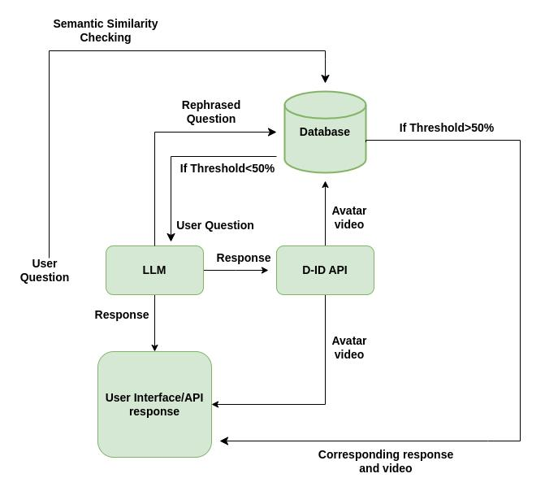

# Versa

Versa is a QnA Retrieval-Augmented Generation (RAG) application designed for the F&I industry. The AI agent, also named Versa, provides quick and accurate answers to user queries, supplemented with videos. Versa significantly reduces response time by leveraging a pre-created database of questions, answers, and videos.

## Features

- **Fast Response Time**: Pre-created database allows for near-instant retrieval of answers and videos.
- **AI-Driven QnA**: Utilizes OpenAI for generating responses when the database does not have a sufficient match.
- **Video Generation**: Generates videos of Versa speaking the answers.
- **Unique Session Handling**: Each user session is uniquely tracked using MongoDB, ensuring personalized interactions.
- **Langchain Trivia Agent**: Uses the REPL tool to add trivia according to the sentiment of the query.
- **Auto-Update**: If any question goes to Rag, Secondary database is automatically updated
## Installation

To install and run Versa, follow these steps:

1. **Clone the Repository**:
    ```sh
    git clone https://github.com/prabhpreetsingh5kwt/demo_rag1.git
    git checkout RagMongo2.2.3
    cd demo_rag1
    ```

2. **Set Up Python Environment**: Ensure you have Python 3.10 installed. You can create a virtual environment using:
    ```sh
    python -m venv venv
    source venv/bin/activate  # On Windows, use `venv\Scripts\activate`
    ```

3. **Install Dependencies**:
    ```sh
    pip install -r requirements.txt
    ```

4. **Configure Environment Variables**: Create a `.env` file in the project root and add your OpenAI and Langchain API keys:
    ```sh
    openai_key="your_openai_key"
    langchain_api_key="your_langchain_api_key"
    ```

5. **Run the Application**:
    ```sh
    streamlit run app.py
    ```

# Download Required Files

Some files are too large to be stored in this repository. Please download them from the following links:

- [Data Folder](https://drive.google.com/drive/folders/18l-1sALXGT6xp4mBnNHQ051Y8lN8FZ2h?usp=sharing)
- [FAISS Index](https://drive.google.com/drive/folders/1JeojO0A495s3NTnaJpYgy_BXn93TxbgI?usp=sharing)

After downloading, place the files in the appropriate directories as follows:

```sh
data/     -> Place the contents of the Data Folder here
faiss_index/ -> Place the FAISS Index file here


```

## Usage

1. **Enter User Details**:
    - Enter your state on the left sidebar.
    - Enter your unique session ID at the top to create a separate MongoDB session for chat history.

2. **Ask Questions**:
    - Type your question into the input box.
    - Versa first checks the secondary database for semantic similarity. If a match above 50% is found, it retrieves the answer and video link from the database.
    - If no sufficient match is found, the query goes to the RAG application to generate a new answer and video link. This new data is then appended to the secondary database for future use.

3. **Langchain Trivia Agent**:
    - The trivia agent uses the REPL tool to add trivia based on the sentiment of the query. This enhances the user experience by providing interesting and relevant trivia.


## Files

1. **`avatar.py`**: Responsible for generating avatar.
2. **`agent.py`**: Responsible for trivia generation using the agent.
3. **`secondarydb` Folder**: Contains all the necessary files for the secondary database.

## Configuration

- **FAISS Index**: The FAISS index is used for efficient similarity search on embeddings.

## Notes

- Ensure your environment variables are correctly set up to avoid authentication issues.
- The pre-created database significantly speeds up the response time by avoiding the need for generating new responses on each query.
- For best results, the database is updated with frequently asked questions and their corresponding answers and videos.

## Disclaimer

This project is currently in beta testing. While the system is designed to provide quick and accurate responses, there may be some latency depending on the query complexity and the system load. We appreciate your understanding and welcome any feedback to improve Versa.


